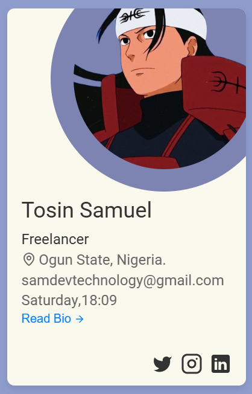

# Profile Card - HNG Stage 1 Task

A responsive profile card component built with HTML, CSS, and vanilla JavaScript. This interactive component features a flipping animation, displaying personal information on the front and a bio on the back.

## 📑 Table of Contents

- [Preview](#preview)
  - [Card Front](#front-preview)
  - [Card Back](#back-preview)
- [Features](#features)
- [Technical Stack](#️technical-stack)
- [Getting Started](#getting-started)
  - [Prerequisites](#prerequisites)
  - [Installation](#installation)
- [Project Structure](#project-structure)
- [Features Breakdown](#features-breakdown)
  - [Front Card](#front-card)
  - [Back Card](#back-card)
  - [Brief Section](#brief-section)
- [Usage](#usage)
- [Customization](#customization)
  - [Changing Profile Information](#changing-profile-information)
  - [Styling](#styling)
- [Responsive Design](#responsive-design)
- [Testing](#️testing)
- [Contributing](#contributing)
- [License](#license)
- [Author](#author)
- [Acknowledgments](#acknowledgments)

## <span id="preview"> 📋 Preview </span>


### <span id="front-preview"> Card Front </span>



### <span id="front-preview"> Card Back </span>


## <span id="features"> 📋 Features </span>

- **Interactive Flip Animation**: Smooth transition between front and back views
- **Responsive Design**: Adapts seamlessly to different screen sizes
- **Real-time Clock**: Displahttps://file+.vscode-resource.vscode-cdn.net/c%3A/Users/USER/Projects/HNG12/Frontend/stage-1/readme.md#%EF%B8%8Ftechnical-stackys current day and time (UTC)
- **Social Media Integration**: Links to Twitter/X, Instagram, and LinkedIn
- **Custom Styling**: Modern design with hover effects and transitions
- **Location Display**: Shows current location with map pin icon
- **Profile Information**: Displays name, job title, email, and profile picture

## <span id="️technical-stack">🛠️ Technical Stack</span>

- HTML5
- CSS3
- Vanilla JavaScript

## <span id="getting-started"> 🚀 Getting Started </span>

### Prerequisites

- A modern web browser
- Basic code editor (VS Code, Sublime Text, etc.)

### Installation

1. Clone the repository:

```bash
git clone [your-repository-url]
```

2. Navigate to the project directory:

```bash
cd [project-directory]
```

3. Open `index.html` in your web browser or use a local development server.

## <span id="project-structure"> 📁 Project Structure </span>

```
project-root/
│
├── index.html          # Main HTML file
├── index.css          # Stylesheet
├── index.js           # JavaScript functionality
│
├── public/
│   ├── assets/
│   │   ├── images/    # Image assets
│   │   └── icons/     # SVG icons
│   │
│   └── ...
│
└── README.md          # Project documentation
```

## <span id="features-breakdown"> 🎯 Features Breakdown </span>

### Front Card

- Profile picture
- Full name (data-testid="fullName")
- Job title (data-testid="jobTitle")
- Current location (data-testid="currentLocation")
- Email address
- Current time and day (data-testid="currentDay", data-testid="currentTimeUTC")
- Social media links with hover effects
- Flip button to view bio

### Back Card

- Detailed bio
- Back button to return to front view

### Brief Section

- Task description
- Collapsible content

## <span id="usage"> 💻 Usage </span>

The profile card can be integrated into any web project. Simply copy the HTML structure and include the corresponding CSS and JavaScript files.

```html
<div class="card-container">
  <div class="flip-card">
    <!-- Front card content -->
    <!-- Back card content -->
  </div>
</div>
```

## <span id="customization"> 🎨 Customization </span>

### Changing Profile Information

1. Update the profile picture in `public/assets/images/`
2. Modify personal information in `index.html`:
   - Name
   - Job title
   - Location
   - Email
   - Bio
   - Social media links

### Styling

- Colors and themes can be modified in `index.css`
- Animation timing and effects can be adjusted in both CSS and JavaScript

## <span id="responsive-design"> 📱 Responsive Design </span>

The profile card is fully responsive and adapts to:

- Desktop screens
- Tablets
- Mobile devices

## <span id="contributing"> 🤝 Contributing </span>

1. Fork the repository
2. Create a feature branch (`git checkout -b feature/AmazingFeature`)
3. Commit your changes (`git commit -m 'Add some AmazingFeature'`)
4. Push to the branch (`git push origin feature/AmazingFeature`)
5. Open a Pull Request

## <span id="author"> 👤 Author </span>

- **Tosin Samuel**
- Email: samdevtechnology@gmail.com
- Twitter: [@samdevtech](https://x.com/samdevtech)
- Instagram: [@samdevtech](https://www.instagram.com/samdevtech)
- LinkedIn: [@samdevtech](https://www.linkedin.com/in/sam-dev-bb1654267)

## <span id="acknowledgments"> 🙏 Acknowledgments </span>

- HNG Internship program for the project requirements
- Icons from Lucide icons
- Twitter: [@samdevtech](https://x.com/samdevtech)
